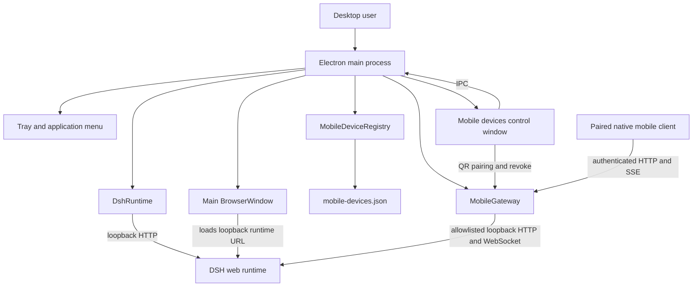

# Desktop architecture

English | [中文](ARCHITECTURE.zh.md)

The Electron desktop application owns one local DeepSeek Harness runtime and is the current authority for its sessions, tools, settings, files, and paired-device registry. The mobile capability is a constrained mapping of that local runtime; it does not start another Agent Loop or persist a second session store.

## Responsibilities

| Component | Responsibility | Data ownership |
|---|---|---|
| `src/main/dsh-runtime.ts` | Starts, observes, restarts, and stops the loopback DSH web child process. | Runtime process lifecycle only. |
| `src/main/index.ts` | Creates Electron windows, the tray, IPC handlers, the paired-device control view, and the local mobile Gateway. | Desktop integration state. |
| `src/main/mobile-device-store.ts` | Persists paired-device snapshots in Electron user data. | Paired-device registry snapshot. |
| DSH web runtime | Runs the Agent Loop and owns durable sessions, workspace state, tools, files, and provider configuration. | Authoritative DSH state. |
| [`@deepseek-ai/dsh-mobile-gateway`](../../packages/mobile/gateway/README.md) | Projects allowlisted desktop state and operations for authenticated native devices. | Connection-local snapshots and subscriptions only. |

## Local transport and security

`DshRuntime` and `MobileGateway` both bind only to loopback addresses. Electron loads the DSH runtime URL in its main window, while the Gateway calls the existing DSH HTTP and downlink interfaces locally. The control window creates a short-lived QR pairing offer; after redemption, the native client uses its paired-device credential for all mobile routes and SSE.

The desktop application does not expose the DSH web runtime, raw DSH API, filesystem, Shell, or provider credentials through the mobile Gateway. A future cross-network relay must preserve this allowlist and device-authentication boundary rather than publish either loopback listener directly.

## Lifecycle

At startup, Electron restores paired-device snapshots, starts the local DSH runtime, starts the local Mobile Gateway against that runtime, and then loads the DSH URL in the main window. On restart, the runtime process is replaced and the main window reloads. On application shutdown, Electron disposes the Gateway and runtime before it exits.
