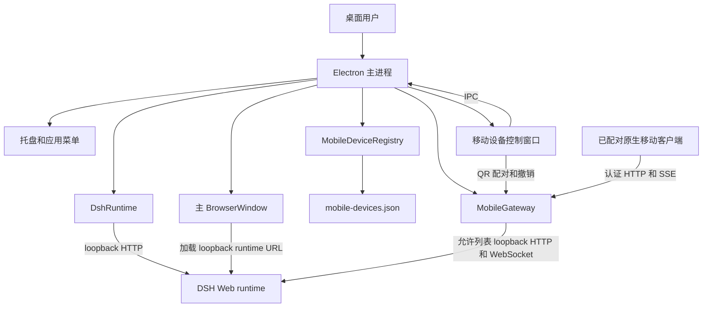

# Desktop architecture

[English](ARCHITECTURE.md) | 中文

Electron 桌面应用拥有一个本地 DeepSeek Harness runtime，并且是当前会话、工具、设置、文件和已配对设备注册表的权威源。移动能力只是对该本地 runtime 的受限映射；它不会启动第二个 Agent Loop，也不会保存第二份会话存储。

## 职责

| 组件 | 职责 | 数据所有权 |
|---|---|---|
| `src/main/dsh-runtime.ts` | 启动、观测、重启和停止 loopback DSH Web 子进程。 | 仅 runtime 进程生命周期。 |
| `src/main/index.ts` | 创建 Electron 窗口、托盘、IPC 处理器、已配对设备控制视图和本地移动 Gateway。 | 桌面集成状态。 |
| `src/main/mobile-device-store.ts` | 在 Electron 用户数据中持久化已配对设备快照。 | 已配对设备注册表快照。 |
| DSH Web runtime | 运行 Agent Loop，并拥有 durable 会话、工作区状态、工具、文件和提供方配置。 | 权威 DSH 状态。 |
| [`@deepseek-ai/dsh-mobile-gateway`](../../packages/mobile/gateway/README.zh.md) | 为认证原生设备投影允许列表内的桌面状态与操作。 | 仅连接本地快照和订阅。 |

## 本地传输与安全性

`DshRuntime` 和 `MobileGateway` 都只绑定 loopback 地址。Electron 在主窗口中加载 DSH runtime URL；Gateway 则在本地调用现有 DSH HTTP 与下行接口。控制窗口创建短时有效的 QR 配对凭据；兑换后，原生客户端会使用已配对设备凭据访问所有移动路由和 SSE。

桌面应用不会通过移动 Gateway 暴露 DSH Web runtime、原始 DSH API、文件系统、Shell 或提供方凭据。未来的跨网络 relay 必须保持这一允许列表和设备认证边界，而不是直接公开任一 loopback 监听器。

## 生命周期

启动时，Electron 恢复已配对设备快照，启动本地 DSH runtime，再针对该 runtime 启动本地 Mobile Gateway，最后在主窗口加载 DSH URL。重启时，runtime 进程被替换，主窗口重新加载。应用关闭时，Electron 会先释放 Gateway 和 runtime，再退出。
