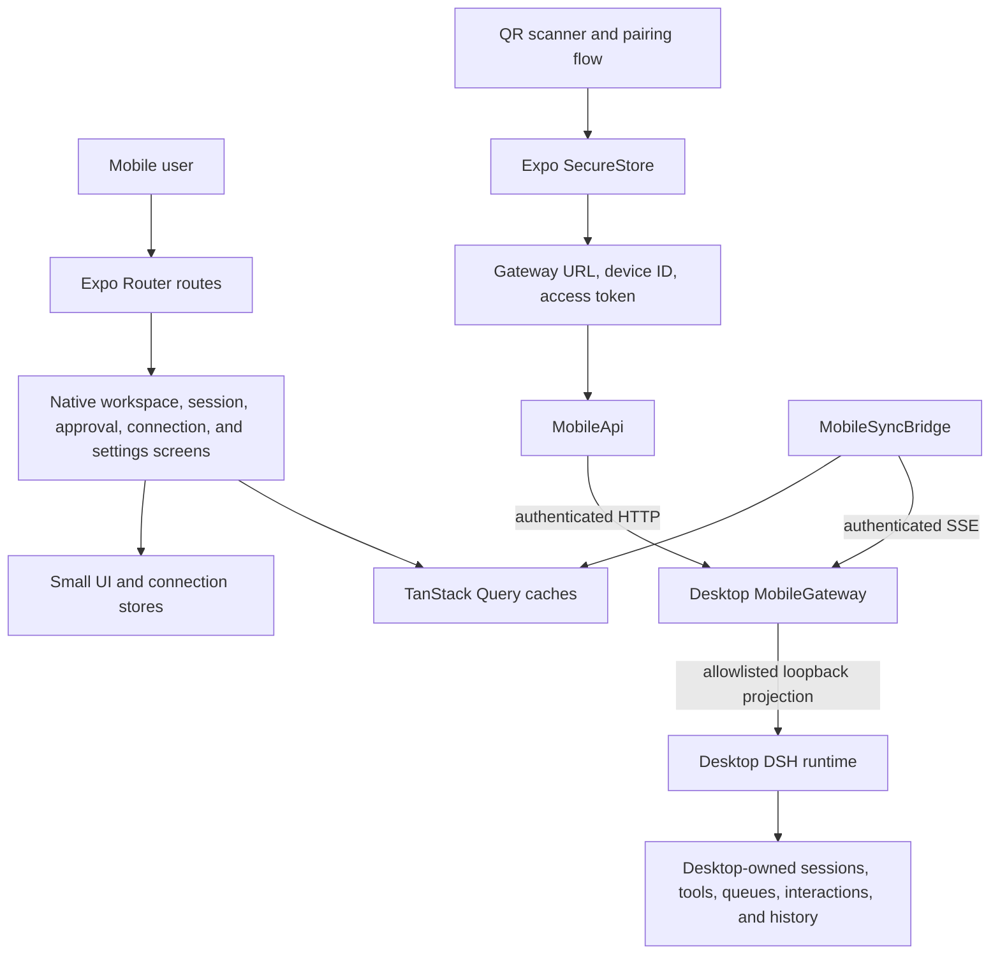

# Mobile architecture

English | [中文](ARCHITECTURE.zh.md)

The native application renders a React Native mapping of the desktop-owned DeepSeek Harness state. It owns native navigation, secure paired-device credentials, presentation state, and query caches. It does not own an Agent Loop, a durable session database, desktop filesystem access, provider credentials, or an independent task executor.

## Responsibilities

| Component | Responsibility | Persistence |
|---|---|---|
| Expo Router routes and native screens | Render native navigation and desktop-mapped conversation, workspace, approval, connection, and settings views. | No durable DSH state. |
| QR pairing flow | Redeems one-time desktop pairing offers and stores the resulting device credential. | SecureStore only. |
| `MobileApi` | Sends authenticated allowlisted HTTP requests to the paired Gateway. | None. |
| `MobileSyncBridge` | Maintains one SSE connection while the app is active, reconnects with bounded delays, and updates query caches. | Transport liveness only. |
| TanStack Query | Caches desktop history, event, queue, job, interaction, and workspace projections for native rendering. | Replaceable client cache. |
| Desktop Mobile Gateway | Authenticates the paired device and projects the permitted desktop operations and events. | Gateway-owned transient snapshots only. |

## Pairing and request flow

The desktop control window creates a short-lived QR offer containing a Gateway URL, pairing identifier, one-time secret, and expiry. The native application scans and redeems that offer, then keeps the Gateway URL, device identifier, and access token in SecureStore. Every later HTTP request and SSE connection carries the paired-device authorization header.

The Gateway remains the authorization and projection boundary. The mobile app can use only its allowlisted routes; it cannot browse desktop paths, open a Shell, read provider credentials, or access the raw DSH API.

## Real-time recovery

While the app is active, `MobileSyncBridge` opens one authenticated `/v1/events` SSE stream. On `gateway/ready`, it discovers running sessions, creates immediate per-session subscription leases, applies transient snapshots, activates each lease with the reported watermark, and refreshes durable history and events from DSH authority.

Durable session entries use DSH `seq` values for de-duplication and recovery. When the app moves to the background, the bridge closes the stream. On return to the foreground, a network error, a Gateway restart, or an expired subscription buffer, it reconnects and reloads the affected query families instead of trying to reconstruct desktop state locally.

## Scope boundary

The current Gateway URL normally resolves to the loopback listener started by the paired desktop application. A cross-network transport is not part of the native UI or this data model. Any future relay must carry the same authenticated Gateway API and SSE traffic without changing the app into a second DSH runtime.
