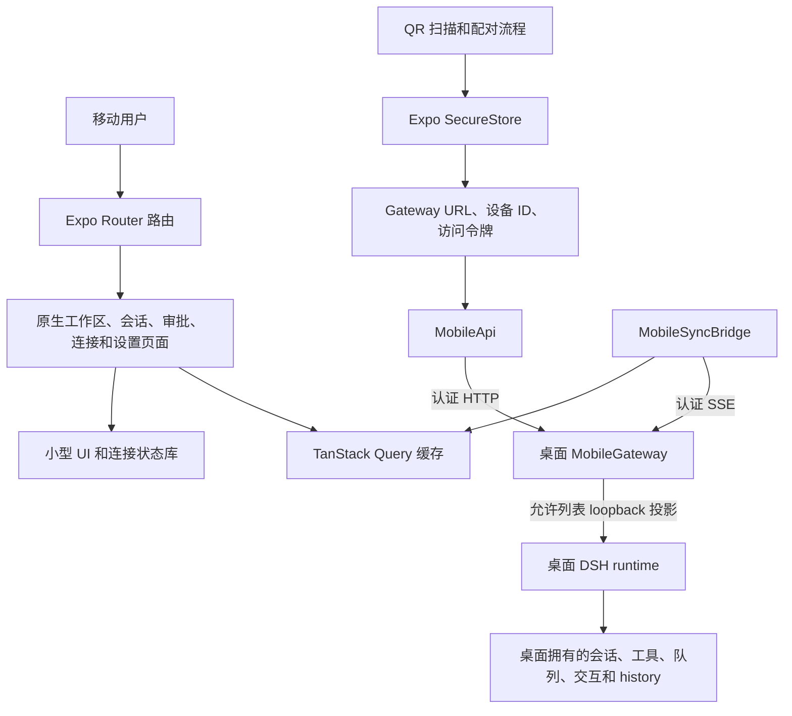

# Mobile architecture

[English](ARCHITECTURE.md) | 中文

原生应用渲染桌面端拥有的 DeepSeek Harness 状态映射。它拥有原生导航、已配对设备安全凭据、展示状态和查询缓存；它不拥有 Agent Loop、durable 会话数据库、桌面文件系统访问、提供方凭据或独立任务执行器。

## 职责

| 组件 | 职责 | 持久化范围 |
|---|---|---|
| Expo Router 路由和原生页面 | 渲染原生导航以及桌面映射的对话、工作区、审批、连接和设置视图。 | 不保存 durable DSH 状态。 |
| QR 配对流程 | 兑换一次性桌面配对凭据并保存生成的设备凭据。 | 仅 SecureStore。 |
| `MobileApi` | 向已配对 Gateway 发送认证后的允许列表 HTTP 请求。 | 无。 |
| `MobileSyncBridge` | 应用活跃时维护一条 SSE 连接，以有界延迟重连并更新查询缓存。 | 仅传输存活状态。 |
| TanStack Query | 为原生渲染缓存桌面 history、事件、队列、作业、交互和工作区投影。 | 可替换客户端缓存。 |
| 桌面 Mobile Gateway | 认证已配对设备，投影允许的桌面操作和事件。 | 仅 Gateway 拥有的 transient 快照。 |

## 配对与请求流程

桌面控制窗口创建一个短时有效 QR 凭据，其中包含 Gateway URL、配对标识、一次性秘密和过期时间。原生应用扫描并兑换该凭据，然后把 Gateway URL、设备标识和访问令牌保存在 SecureStore。之后的所有 HTTP 请求和 SSE 连接都会携带已配对设备认证头。

Gateway 始终是认证和投影边界。移动应用只能使用其允许列表路由，不能浏览桌面路径、打开 Shell、读取提供方凭据或访问原始 DSH API。

## 实时恢复

应用处于活动状态时，`MobileSyncBridge` 打开一条认证 `/v1/events` SSE 流。收到 `gateway/ready` 后，它发现运行中会话，建立即时的逐会话订阅租约，写入 transient 快照，以返回的水位线激活每个租约，并从 DSH 权威源刷新 durable history 和事件。

Durable 会话条目使用 DSH `seq` 值去重和恢复。应用进入后台时，桥接层关闭事件流。回到前台、网络错误、Gateway 重启或订阅缓冲过期时，它会重连并重新加载受影响的查询族，而不会在本地重建桌面状态。

## 范围边界

当前 Gateway URL 通常指向已配对桌面应用启动的 loopback 监听器。跨网络传输不属于原生 UI 或本数据模型。未来的 relay 必须承载相同的认证 Gateway API 和 SSE 流量，不能把应用改造成第二个 DSH runtime。
